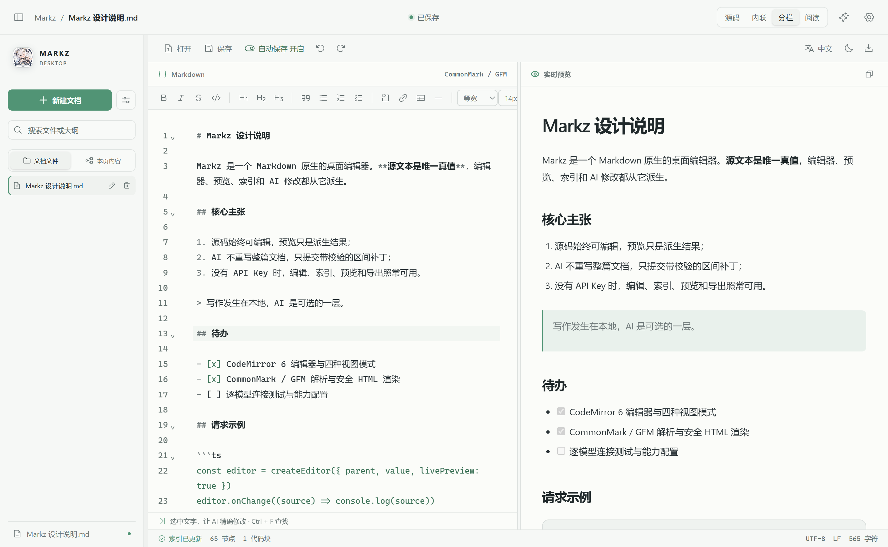
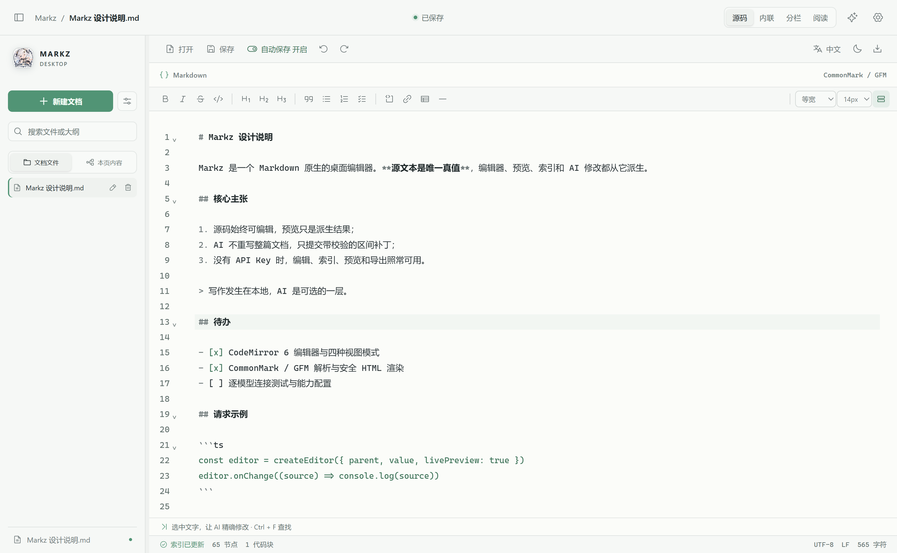
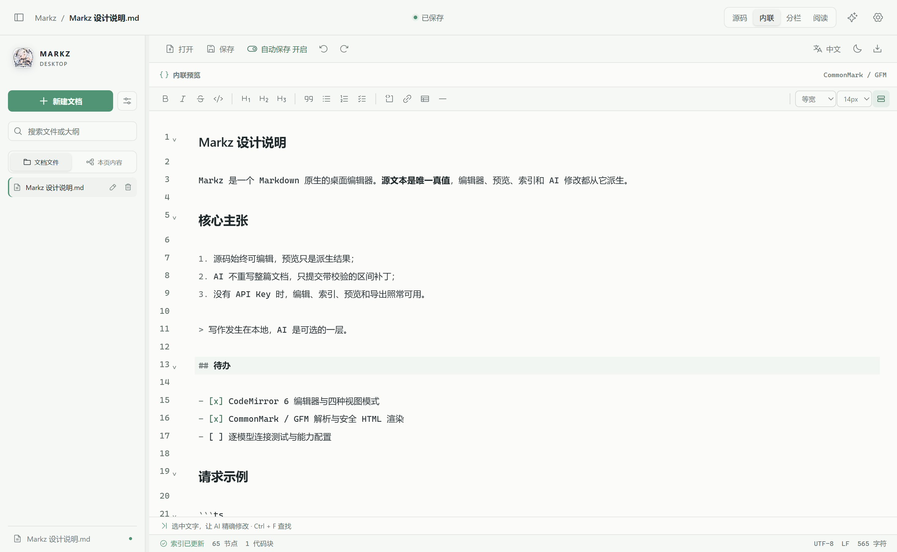
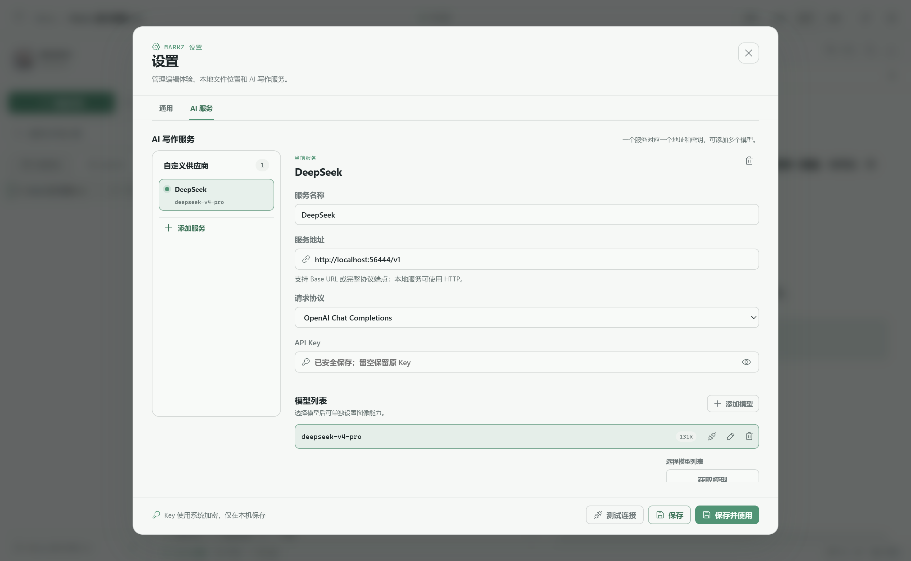
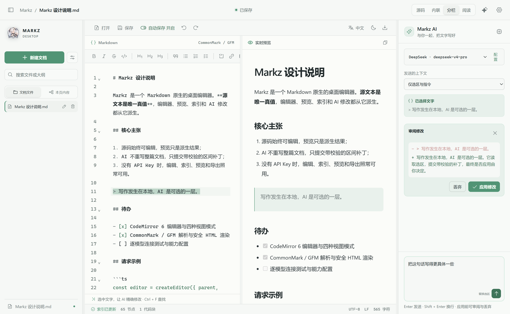
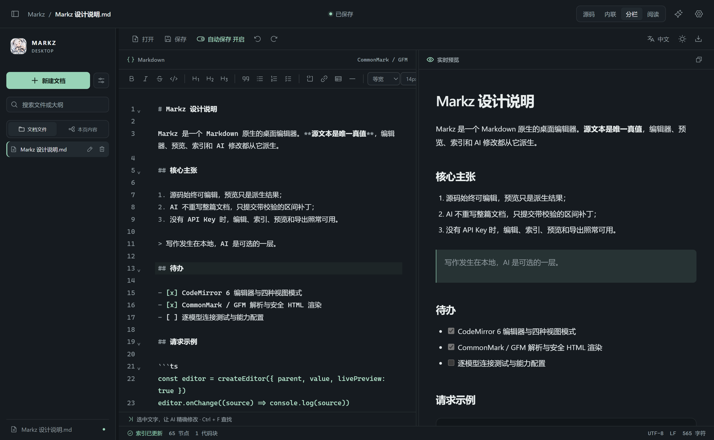

# Markz Desktop

> Markdown 源文本是唯一真值。编辑器、预览、索引和 AI 修改都从源文本派生。

Electron + TypeScript 的 Markdown 桌面编辑器，同时提供可嵌入的 Vanilla / React SDK。

---

## 考题

> 请为以下开源项目提交一个 pull request，开放命题，根据自身能力自行决定 PR 难度。
> 项目地址：<https://github.com/floatboatai/Nexus-Editor>

我认为这个项目做的不很好，自己总结了一下项目的特点，然后自己根据原有项目的功能重写了一个项目。使用的是 codex 进行编写。但是近期 chatgpt 风控严格，并且服务模型经常过载，时间紧张，就写到这里了。AI 功能还有很多问题，我也很喜欢这个项目，后面会进行更新的。

## 这是我的答卷

题目是「为 Nexus-Editor 提交一个 PR」，我没有提局部 PR，而是把它最核心的主张——**Markdown 源文本为唯一真值，AST、索引、预览和 AI 提案全部是派生数据**——用 Electron + TypeScript 从头实现了一遍，并把它拆成了「无头内核 + 可嵌入 SDK + 桌面外壳」三层。

代码是自己写的，没有二开 Nexus-Editor，仓库里不包含该项目的任何源码（见 [关于独立开发](#关于独立开发)）。选这个做法是因为：Nexus-Editor 的定位里「文本真值 + 无头 SDK + 可扩展」这几条是连在一起的，只改其中一个点，验证不了这套主张到底能不能落地。整份重写一遍，反而更能说明哪些设计是必要的、哪些是我想当然了。

AI 部分还有很多问题，后面会继续更新。



---

## 技术栈

| 层面 | 选型 |
| --- | --- |
| 语言 | TypeScript 5.8，ESM，`strict` |
| 桌面运行时 | Electron 37（主进程 / preload / 渲染进程三段隔离） |
| 界面 | React 19，手写 CSS（无 UI 框架、无 CSS-in-JS） |
| 编辑器 | CodeMirror 6（state / view / commands / lang-markdown / search）+ Lezer 语法树 |
| Markdown | unified 生态：remark-parse、remark-gfm、remark-rehype、rehype-sanitize、rehype-stringify；mdast 与 hast |
| AI 传输 | 自己实现的 `fetch` + SSE 解析，不依赖任何厂商 SDK |
| 构建 | Vite 6 + electron-vite，electron-builder（NSIS 安装版 / 便携版） |
| 测试 | Vitest（单元）、Playwright（真实 Electron 窗口冒烟与几何测量） |
| 包管理 | pnpm |

### 为什么没有用 AI 厂商 SDK

三家的流式协议差异（`chat/completions`、`responses`、`anthropic messages`）并不大，但每家 SDK 都会把「用户自己的服务地址」这件事锁死在自己的云上。这个项目要支持任意兼容端点、要能指向 localhost、要能把密钥留在主进程，所以传输层是自己写的，只依赖 `fetch` 和 `ReadableStream`。

## 架构

```text
src/core/        无头内核 —— 不依赖 DOM、Electron、React，可单独运行
src/ai/          协议层 —— 三种协议的生成、流式解析、模型发现
src/sdk/         可嵌入层 —— 把内核 + CodeMirror 封装成 NexusEditor / <Editor>
src/renderer/    桌面界面 —— React，通过 window.nexus 与主进程通信
electron/        主进程 —— 窗口、IPC、文件、配置、安全策略
src/shared/      主进程与渲染层共享的类型契约
```

### 内核：源码 → 编译产物

`src/core/` 是整份代码的地基，也是唯一被桌面端和 SDK 共用的部分。一次编译（`compileMarkdown`）产出一份完整的、可寻址的派生产物：

```ts
{ source, ast, index, diagnostics, revision, hash }
```

- **`index`** 不是简单的目录列表，而是**可寻址的节点索引**：每个节点带稳定 id、父节点链、深度、在源码中的精确区间，标题节点额外带 `sectionRange`（整节范围），代码块带 `contentRange` 和语言。AI 要改什么，先在这里定位。
- **`diagnostics`** 双语（中 / 英），覆盖原始 HTML、不安全的链接协议（`javascript:` / `data:` 等）、插件异常。
- **`revision` + `hash`** 是版本凭据，所有修改都必须带着它们，用于拒绝过期写入。

`segmented.ts` 处理超大文档的分段解析，避免一次性把整篇塞进解析器。

### 精确修改：AI 不改整篇文档

这是整个项目最关键的设计。AI 生成的从来不是一份新文档，而是一个**针对源码区间的补丁**：

```ts
{ from, to, replacement, expectedText, expectedHash, expectedRevision }
```

应用前要过三道校验：revision 是否过期、该区间内容的哈希是否还匹配、原文是否逐字相同。任何一道不过就直接拒绝，报 `STALE_REVISION` / `STALE_HASH` / `TEXT_MISMATCH`，而不是把用户的改动覆盖掉。补丁也不允许越界或互相重叠，不会切开 UTF-16 代理对，也不会把 CRLF 从中间截断。

这样即使是流式生成的过程中用户还在继续编辑，也不会写出错位的文本。

### 渲染进程零网络

生产构建的 CSP 里 `connect-src` 是 `'none'`，渲染进程**根本没有权限发网络请求**。所有 AI 调用都通过 IPC 交给主进程执行，密钥也只在主进程读写。加上 `sandbox: true`、`contextIsolation: true`、`nodeIntegration: false`、拒绝一切权限请求、禁止 `window.open` 与页面跳转——渲染进程即使被注入，也拿不到密钥、发不出请求、碰不到文件系统。

### 编译不阻塞界面

解析、建索引、渲染 HTML 都在 Web Worker 里跑（`compile.worker.ts`），主线程只拿回索引、诊断和 HTML，AST 留在 Worker 里。任务做了 220 ms 防抖和单飞合并，回来的结果会比对 revision，过期的直接丢弃，所以打字很快时不会出现「预览比内容晚一拍」。

### 插件契约

内核预留了三类扩展点，都是纯函数式的，不要求修改内核代码：

- **`syntax`** —— 往 remark 管线里挂语法插件；
- **`render`** —— mdast → mdast 的变换，或 hast 层的 rehype 插件，或 CodeMirror Widget；
- **`editor`** —— 直接注入 CodeMirror 扩展和自己的命令。

重复的插件 id 会直接抛错，避免静默覆盖。

### 诊断日志

启动、退出、窗口创建、未捕获异常与未处理的 Promise 拒绝、子进程退出、渲染进程崩溃、生成请求的开始与终态，都会写进 `logs/desktop.log`。日志**同步写入**——退出路径那几行往往是一个进程最后写下的东西，异步追加会随进程结束一起丢掉。

凭据、提示词和文档内容一律不落日志，只记录协议、主机、模型和错误码，所以这份日志可以直接贴出来排查问题。

## 功能点

### 编辑与格式

- CodeMirror 6 源码编辑（桌面端挂 CodeMirror 官方 `basicSetup`）：语法高亮、行号、括号匹配与自动闭合、多光标与矩形选择、搜索面板、撤销历史；
- 四种视图模式：源码 / 内联（live preview）/ 分栏 / 阅读；
- 格式工具栏 14 个命令：粗体、斜体、删除线、行内代码、链接、三级标题、引用、无序 / 有序 / 任务列表、代码块、分隔线、表格。每个命令都是「文档 + 选区」的纯函数，返回一处编辑，且是**可切换**的——对已加粗的选区再点一次会还原；
- 内联模式只隐藏选区之外的标记（`**`、`#`、反引号），光标所在的语法永远保持可见可编辑；
- 快捷键：新建 `Ctrl+N`、打开 `Ctrl+O`、保存 `Ctrl+S`、另存为 `Ctrl+Shift+S`、AI 设置 `Ctrl+,`，编辑器内还有 `Ctrl+F` 查找。

源码模式（标记全部可见，上方是格式工具栏）：



格式工具栏的 14 个命令与字号、字体、自动换行设置：


### 预览与导出

- CommonMark + GFM（表格、任务列表、删除线、自动链接）解析；
- 安全渲染：rehype-sanitize 白名单，原始 HTML 只留在源文里、不进预览，不安全的链接协议会被剥掉；
- 输出带源码位置映射（`dataSourceLine` / `dataSourceOffset`），预览可以反向定位到源码行；
- 导出独立 HTML。

内联模式把标记收起来，按源码排版直接阅读：



### 文件与工作区

- 默认 `Documents/Markz` 工作区的目录浏览、新建、重命名、删除；
- **路径越权防护**：只能操作工作区内的 `.md` / `.markdown` 文件，路径经过 `resolve` + `realpath` 双重校验，软链接也绕不出去；文件名拒绝 Windows 保留名与非法字符，缺省补 `.md`；
- **写入原子化**：临时文件 + `rename`，写一半断电不会留下半个文档；
- **冲突检测**：打开时记录 SHA-256 指纹，保存时同时比对磁盘现状和调用方指纹，任一处不符就报 `FILE_CONFLICT` 并建议另存为，不会覆盖外部改动；
- 打开 / 另存 Markdown 文件，保留原文件的 BOM，单文件上限 32 MiB；
- 自动保存，草稿恢复——未保存内容在下次启动时可以恢复成独立文档，原文件不动；
- 关闭前拦截未保存内容，三选一（取消 / 保存 / 关闭）。

### AI 服务配置

- 三种协议：`chat/completions`、`responses`、`anthropic messages`；
- 服务地址校验：强制 HTTPS（仅 localhost 允许 HTTP），拒绝把账号密码塞进 URL，自动剥掉 `/chat/completions`、`/messages` 这类后缀；
- 「获取模型」直接把返回的模型合并进列表（按 id 去重、保留已设能力、自动选中第一个），并读取 `context_window` / `context_length` / `max_model_len` 作为上下文上限；
- 兼容服务在哪儿提供模型列表并不统一，所以按同源候选路径依次尝试，凭据只在同一 origin 内使用；全部 404 / 405 时明确提示「该服务未提供可用的模型列表接口」并列出已尝试的路径，请用户手动填写模型 ID；
- 能力逐模型配置：文本固定开启，图像、流式、工具、结构化输出、推理与推理强度由用户按模型勾选，切换模型时各自的配置互不干扰；
- 连接测试逐个模型探测，行内显示「测试中 / 可用 / 失败」徽标，「测试全部模型」给出汇总；遇到鉴权、超时、404 这类配置级失败立即停止，不会让每个模型都等满超时；
- 密钥不明文落盘，界面与日志里一律打码。

模型列表来自「获取模型」，每个模型单独配置能力，也可以逐个测试连通性（截图为本地模拟服务，因此地址是 localhost）：



### AI 写作

- 提案锚定在选区（或光标位置）上，携带 `from / to / expectedText / revision`，应用前做三重校验；
- 流式生成，正文与推理（reasoning）分开处理——**推理过程只是进度，永远不会写进文档**；增量按 40 ms 合批，避免每个 token 都触发一次渲染；
- 发送前先按模型上下文预算检查，超了就明确报错，绝不静默截断上下文；
- 命中长度上限的提案标记为「已截断」，不会被误当成完整结果应用；
- 模型只返回推理、没有正文时，不留下一个永远无法应用的空白提案，直接提示换模型或检查推理设置；
- 差异查看、应用 / 撤销；生成过程中随时可以取消，取消不会改动文档。
- 已在真实 DeepSeek 端点上跑通完整链路：`anthropic-messages` 协议 + `deepseek-v4-pro`，多次流式生成正常结束（实测单次 8–53 秒）。

提案锚定在选区上，右侧列出将被替换的原文与生成结果，确认后才会写入：



### SDK

同一份内核编成 SDK，不依赖 Electron API，可以跑在浏览器或任何 DOM 容器里，供外部项目嵌入。`pnpm build:sdk` 会产出 `dist-sdk/` 下的四个 ES 入口：`core`（无头内核）、`editor`（CodeMirror 编辑器）、`react`（React 组件）、`ai`（AI 传输层）。在仓库内也可以直接按源码路径引用：

```ts
// Vanilla
import { createEditor, livePreview } from './src/sdk'

const editor = createEditor({
  parent: document.querySelector('#editor')!,
  value: '# Hello',
  extensions: [livePreview()],
})
editor.onChange((source, revision) => console.log(source))

editor.ast        // 派生 AST
editor.index      // 可寻址索引
editor.diagnostics
await editor.toHTML()
```

```tsx
// React
import { Editor } from './src/sdk/react'

<Editor value={text} onReady={(editor) => console.log(editor.index)} />
```

`NexusEditor` 暴露 `value`、`ast`、`index`、`diagnostics`、`revisionNumber`、`getSelectedText()`、`setValue()`、`toHTML()`、`focus()`、`destroy()`，以及 `onChange` / `onFocus` / `onBlur` 订阅。编译带缓存，文档没变就不会重复解析。配合 `patchForNode` 与 `applyPatch` 可以在宿主里复用同一套精确修改。用法详见 [SDK API](docs/02_开发/SDK_API.md)，最小示例见 [`examples/`](examples/)。

### 界面

中文 / English 双语（默认中文），浅色 / 深色主题，编辑器字号、字体族、自动换行、自动保存可调。弹窗支持 Escape 关闭、焦点恢复和 Tab 循环。

深色主题：



英文界面（同一份文档，界面语言独立于文档内容）：


## 开发

```powershell
pnpm install
pnpm dev
```

检查与构建：

```powershell
pnpm typecheck     # tsc --noEmit
pnpm test          # vitest
pnpm build         # electron-vite build
pnpm build:sdk     # 产出 dist-sdk/
```

如果当前环境无法下载 Electron 桌面二进制，可以先执行 `pnpm install --ignore-scripts`，这样类型检查、单元测试和生产构建仍然可以完成，只是启动不了桌面窗口。

冒烟测试（需要 Electron 二进制）：

```powershell
pnpm desktop:smoke     # 通用桌面流程
pnpm format:smoke      # 格式工具栏
pnpm ai:smoke          # AI 提案 / 应用 / 冲突 / 取消
pnpm settings:smoke    # 设置页与模型列表
pnpm sdk:smoke         # SDK
pnpm screenshots       # 重新生成本 README 里的截图
```

`pnpm screenshots` 会启动真实窗口，用一个本地模拟服务当 AI 提供方，把 8 张截图写回 `assets/screenshots/`。每一张在拍摄前都会断言界面处于预期状态，所以重跑不会产出空白或半加载的图。

打包：

```powershell
pnpm package            # Windows 默认
pnpm package:portable   # 便携版
pnpm package:nsis       # NSIS 安装版
```

## 目录

```text
electron/
  main.ts          窗口创建与安全策略（CSP、权限、导航拦截）
  bridge.ts        IPC 集中注册
  preload.ts       contextBridge 暴露的 window.nexus 契约
  files.ts         工作区文件读取、保存、指纹校验
  settings.ts      配置、密钥、模型能力
  menu.ts          应用菜单
src/core/          无头内核：编译、索引、补丁、查询、插件契约
src/ai/            协议层：端点推导、配置校验、流式传输
src/sdk/           Vanilla / React SDK，live preview，Widget
src/renderer/      React 界面：编辑器、预览、大纲、AI 面板、设置
src/shared/        跨进程类型契约
scripts/           冒烟测试、截图脚本、基准、构建辅助
tests/             AI 协议测试
examples/          SDK 最小示例
assets/screenshots/ 本 README 使用的截图（由 pnpm screenshots 生成）
docs/              需求规格说明书、SDK 文档、验证记录
```

## 文档

- [需求规格说明书](docs/01_需求/需求规格说明书.md) — 正式范围、边界，以及参考项目与使用边界
- [SDK API](docs/02_开发/SDK_API.md)
- [交付与验证](docs/03_验收/交付与验证.md)

## 许可

本项目采用 [PolyForm Noncommercial License 1.0.0](LICENSE)：个人学习、研究、实验、业余项目，以及慈善、教育、公共研究、公共卫生、环保和政府部门等非营利组织都可以使用，**任何商业用途都不被许可**。需要商用授权请通过 <https://github.com/youxiandechilun> 联系作者。

需要说明的是，这是一种「源码可用」（source-available）协议，不属于 OSI 定义的开源协议——因为它限制了使用领域。

### 关于独立开发

本项目的代码为作者独立开发，不是对任何现有项目的二次开发或分支：

- **Nexus-Editor**：只参考了用户提供的项目介绍（用于确定功能定位），**没有审查或使用其源码**，仓库中不包含该项目代码；
- **MarkText**：只读取了官方 README 与官方截图，用于参考视觉与布局；未使用其源码，其 WYSIWYG、PDF 等能力也不在本项目范围内；
- 依赖库（CodeMirror 6、unified / mdast、React、Electron 等）均为正常的第三方依赖，各自遵循其自身协议。
