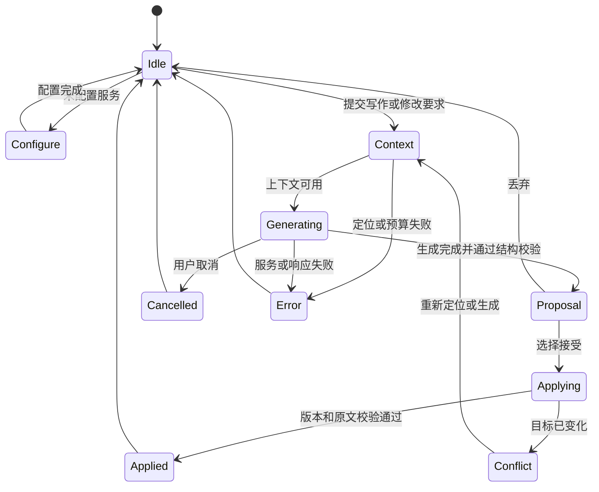

# Markdown 编译与 AI 编辑 SDK 需求规格说明书

| 项目 | 内容 |
| --- | --- |
| 文档编号 | MARKZ-SRS |
| 文档修订 | 1.0，需求整理稿；这是文档修订号，不代表分期开发 |
| 整理日期 | 2026-09-16 |
| 产品名称 | 待定；本文使用工作目录代号 `markz` |
| 交付形态 | Electron 桌面应用 + 框架无关 TypeScript SDK + 官方编辑器 UI |
| 技术栈要求 | Electron + TypeScript；编辑器使用 CodeMirror 6，Markdown 管线使用 unified / mdast |
| 开发范围 | 一次完整交付；所有纳入功能均属于本次开发 |
| 文档状态 | 用户已明确功能边界及代码修改范围；具体协议组合、框架绑定及部分工程数值见第 16 节 |
| 需求权威来源 | 本文；早期讨论中与本文不一致的功能安排已经失效 |

> **阅读约定：**“已确认”表示用户明确提出的要求；“编制建议”表示为使需求可实现、可验收而提出的细化方案。未实现功能及性能指标均为需求目标，不是已完成结果。

## 1. 产品定义与目标

### 1.1 产品定义

提供一个以 Markdown 源文本为唯一文档真值的编译与编辑 SDK，使用带位置信息的 AST 驱动编辑、内联预览、HTML 输出、插件和文档索引，并内置可配置的 AI 自动写作与精确修改能力。最终用户产品以 Electron 桌面应用交付；SDK 是可被该应用及其他宿主集成的复用核心。

开发者可以直接集成官方编辑器组件，也可以使用无头核心构建自己的界面。官方界面参考 MarkText 的简洁布局与阅读体验，提供中文和英文两套界面语言，默认中文。

### 1.2 两类用户

| 用户 | 目标 | 产品提供的价值 |
| --- | --- | --- |
| SDK 集成开发者 | 为笔记、文档 CMS、技术写作或 LLM 产品接入 Markdown 编辑能力 | 统一的文档、编辑、索引、AI 和插件 API；可直接使用的 UI；简短集成路径 |
| 宿主应用中的写作者 | 编辑真实 Markdown，并让 AI 帮助生成、改写和修改文内代码 | 专注的编辑界面、可选内联预览、按需出现的 AI 面板、可检查和撤销的修改 |

SDK 不要求用户注册产品账户。模型服务使用者自己的 API 配置；宿主应用可以接管文件、凭据和网络请求。

### 1.3 核心目标

1. **真实 Markdown：**读取、编辑、预览和保存不擅自重新排版源文件。
2. **容易集成：**Vanilla API 与一个官方主流框架绑定覆盖初始化、取值、事件、销毁和 AI 配置。
3. **轻量与流畅：**基础编辑不依赖 AI 模块；按需加载预览、语法高亮和 AI；用可复测指标评价大文档表现。
4. **便于 LLM 定位：**结构索引能把请求定位到文档、章节、节点、行列和源码范围。
5. **精确修改：**AI 生成修改提案，通过版本及原文校验后应用文本补丁，保留未修改内容。
6. **简洁美观：**正文占据视觉中心，设置清楚，工具按上下文出现。
7. **完整双语：**界面、错误、提示和可访问性标签覆盖简体中文、英文，首次启动默认中文。

### 1.4 参考项目与使用边界

| 参考 | 用于参考的内容 | 证据与限制 |
| --- | --- | --- |
| [Nexus-Editor](https://github.com/floatboatai/Nexus-Editor) | Markdown 文本真值、无头 SDK、CM6、AST、Widget 与插件定位 | 来源为用户提供的项目介绍；未审查源码，不以竞品宣称代替本产品验收 |
| [MarkText](https://github.com/marktext/marktext) | 留白、正文排版、侧栏、浮动工具栏、克制的界面层级 | 已读取官方 README，并查看官方截图；参考视觉与布局，功能范围以本文为准 |
| zcode | 易用的服务地址、协议、API Key、模型获取和能力配置流程 | 用户提供的是名称与期望，未提供明确版本或链接；本文不声称复刻其具体实现 |

MarkText 的公开介绍包含 WYSIWYG、PDF 等能力。这些内容不因视觉参考而进入本产品范围。

## 2. 一次性交付范围

### 2.1 已确认的必做能力

| 用户清单 | 必做能力 | 本文位置 |
| --- | --- | --- |
| 1 | Markdown 文本作为唯一存储真值 | §4.1，MD-01～MD-03 |
| 2 | CommonMark / GFM | §4.2，MD-04 |
| 3 | 带位置信息的 AST | §4.3，AST-01 |
| 4 | 文件、行号、列号和错误码 | §4.3，AST-03 |
| 5 | CodeMirror 6 编辑运行时 | §4.4，ED-01 |
| 6 | 可选的内联预览 | §4.4，ED-02 |
| 7 | HTML 输出 | §4.5，HTML-01 |
| 8 | 基础 Widget API | §4.6，EXT-01 |
| 9 | 编辑器插件、语法插件、渲染插件 | §4.6，EXT-02 |
| 10 | Vanilla API | §10，SDK-01 |
| 11 | 一个主流框架绑定 | §10，SDK-02 |
| 12 | 源文本与 AST 的位置映射 | §4.3、§5，AST-02 |
| 13 | 大文档性能测试 | §12，PERF-01～PERF-09 |
| 14 | 格式保真测试 | §14，AT-01～AT-03 |
| 新增 A | AI 自动写作，方便配置 URL、三种协议、API Key、模型与能力 | §6～§7 |
| 新增 B | 轻量、高性能、带索引、方便 LLM 定位和修改代码 | §5、§7、§12 |
| 新增 C | 漂亮简洁的 UI，参考 MarkText | §8 |
| 新增 D | 中文、英文两套语言系统，默认中文 | §9 |

这些能力均须在本次完整交付中完成。内部可以安排开发先后，但不以“下一版补齐”作为验收结论。

### 2.2 明确排除

以下内容不纳入本次产品，也不作为预设的后续路线图：

1. 多人实时协作；
2. CRDT；
3. 评论与 @提醒；
4. 插件市场；
5. 云端账户；
6. 多种复杂输出格式，例如 PDF、DOCX、EPUB、PPT；
7. 移动端产品及移动端适配承诺；
8. 完整 WYSIWYG。

说明：本地插件注册仍须实现；调用外部模型 API 不等于建设云端账户；HTML 是明确纳入的输出格式；内联预览不改变 Markdown 源文本的文档地位。

### 2.3 宿主边界（编制建议）

- 提供可运行的 Electron 桌面应用作为官方宿主和完整功能示例；SDK 可被其他 Electron 宿主集成。
- Web 浏览器中的独立示例不作为主要交付形态；若提供，仅用于组件演示和 API 调试。
- 文件系统、长期凭据、应用账户和项目目录由宿主提供适配器。
- 核心不要求数据库、云端服务、向量数据库或专有文档格式。
- 索引覆盖当前 Markdown 文档以及宿主明确提供的 Markdown 文档集合；不自动扫描用户磁盘。
- “修改代码”已确认为 Markdown 源码与文内代码块，不包含独立项目代码文件。

## 3. 主要使用流程

### 3.1 开发者集成

安装所需模块 → 创建编辑器并传入 Markdown → 订阅变更 → 接入宿主保存 → 选择是否开启预览与 AI → 销毁实例时释放资源。

官方示例必须同时展示最小无 AI 集成和完整 AI 集成。未配置 AI 时，普通编辑、预览和 HTML 输出可独立使用。

### 3.2 作者编辑文档

打开 Markdown → 在源码或内联预览模式中编辑 → 使用大纲定位章节 → 保存 Markdown 或导出 HTML。

切换预览、主题和界面语言应保留原文、选区、撤销历史和滚动位置。

### 3.3 配置 AI 服务

打开“设置 / AI 服务” → 添加服务 → 填写名称和服务地址 → 选择请求协议 → 输入 API Key → 测试连接 → 获取模型或手动添加 → 设置模型能力 → 选择默认模型 → 保存。

连接测试和模型列表获取分别反馈结果。服务不支持枚举模型时，可以手动输入模型 ID 后继续使用。

### 3.4 AI 自动写作

输入主题或要求 → 选择生成范围与模型 → 显示本次使用的上下文 → 流式生成候选稿 → 插入或替换 → 一次撤销可恢复应用前内容。

### 3.5 AI 定位与修改

提出修改要求 → 查询文档索引 → 定位节点与源码范围 → 获取相关上下文 → 生成修改提案 → 显示原文与改文差异 → 校验版本和目标内容 → 用户应用选中修改 → 更新索引。

生成期间用户仍可编辑。若目标已发生变化，提案进入冲突状态，不覆盖新的人工修改。

## 4. Markdown、编辑器与扩展需求

### 4.1 文档真值与格式保真

**MD-01｜源文本真值**

- Markdown 字符串是文档内容唯一真值；AST、索引、HTML 和预览均为派生结果。
- SDK 的取值与保存接口返回当前 Markdown 原文。
- 不在 Markdown 中插入内部节点 ID、索引元数据或隐藏的专有标记。
- 结构化编辑及 AI 修改最终落实为明确的文本变更。

**MD-02｜无操作往返保真**

- 打开、切换视图、查看预览、获取 AST、导出 HTML 不得改变 Markdown。
- 对字符串输入，保持 UTF-16 内容逐单元一致；保留空白、软换行、列表标记、代码围栏、引用写法等。
- 文件适配器保留 UTF-8 文件的 BOM、原有换行符等元数据；未编辑读回再保存时应逐字节一致。
- 若 CM6 内部规范化换行，运行时须维护到源文的映射及换行信息，不把内部规范化结果直接覆盖源文件。
- 字符串层保真与文件层逐字节保真分别验证，不能混用结论。

**MD-03｜局部修改保真**

- 修改只改变明确的目标范围；目标外字符串保持一致。
- 不将完整 AST 重新序列化作为每次编辑或保存的路径。
- 对同一事务内多个补丁检查重叠、顺序、边界和原文匹配；全部校验成功后原子应用。
- 所有用户可应用的修改进入编辑器撤销历史。

### 4.2 语法能力

**MD-04｜CommonMark / GFM**

- 支持 CommonMark 基本语法，以及 GFM 表格、任务列表、删除线、自动链接等扩展。
- 实现时固定所采用的规范版本、解析器版本与差异清单，并在验收报告中记录。
- 不完整语法应遵循 Markdown 的容错规则显示原文，不能把普通未闭合输入一律判为编译失败。
- 未识别扩展保留源文本，并提供语法插件接入点。
- 数学公式、Mermaid、MDX、Pandoc 扩展等不自动成为内置语法要求；代码块中的相应内容仍须完整保留。

### 4.3 AST、映射与诊断

**AST-01｜带位置的 AST**

- 采用 unified / mdast 方向，向外提供可追溯到源文档版本的结构快照。
- 每个源节点关联 `documentId`、`revision`、类型和起止范围；合成节点明确标注来源或无直接源码范围。
- 插件改动派生 AST 不得隐式改写原文。

**AST-02｜位置映射**

- 编辑器与公共补丁接口的 offset 使用 JavaScript UTF-16 code unit；范围采用 `[start, end)`。
- 面向用户的行、列从 1 开始；公共接口必须说明列的计数规则，不能混用字节、Unicode 码点与 UTF-16。
- 提供 offset ↔ 行列、位置 → 节点、节点 → 源范围、预览块 → 源范围的转换。
- 编辑事务携带位置映射；过期 AST 与当前文档版本不得被当成同一快照使用。
- 覆盖中文、emoji、组合字符、CRLF、制表符、重复文本和嵌套节点；禁止在代理对或 CRLF 中间应用补丁。

**AST-03｜诊断**

- 诊断至少包括文档标识/文件路径（宿主提供时）、范围、行列、稳定错误码、严重级别、可本地化消息及来源。
- 诊断用于插件错误、非法操作、资源解析、渲染、索引和 AI 等实际异常；区分错误、警告、提示。
- 点击诊断可定位到对应内容；没有源范围的网络或配置错误定位到相关配置项。
- 错误码稳定且不随界面语言变化；不存在文件路径时不得虚构路径。

### 4.4 编辑运行时与预览

**ED-01｜CodeMirror 6 运行时**

- 支持输入、选区、复制粘贴、查找替换、基础 Markdown 命令、快捷键、撤销/重做、只读模式与程序化编辑。
- 中文输入法合成期间不执行会打断输入的预览替换、自动补丁或命令触发。
- 区分用户、AI、插件和宿主引发的变更，避免绑定重复回写。
- 多实例相互独立；实例销毁时释放监听器、Worker、计时器和正在进行的请求。

**ED-02｜可选内联预览**

- 提供源码模式和内联预览模式；SDK 通过配置显式控制，官方 UI 提供直接切换入口。
- 内联预览在非编辑位置展示效果，光标进入或选区覆盖时提供可编辑源码。
- 预览覆盖标题、强调、链接、图片、列表、引用、表格和代码块的基本展示。
- 多行选择、复制、撤销和输入法行为保持可预测；复制源文本不混入 Widget DOM 文本。
- 官方 UI 建议默认开启内联预览；无头 SDK 建议显式启用。该默认值属于编制建议。

**ED-03｜文档导航与状态**

- 大纲由标题索引生成，支持点击定位与当前章节指示。
- 显示保存状态、字数/字符数、光标位置和必要的索引状态；宿主保存失败时不显示“已保存”。
- 索引正在重建时允许继续输入，需使用精确索引的 AI 修改暂不可应用。

### 4.5 HTML 输出

**HTML-01｜一致的 HTML 编译结果**

- 提供 HTML 片段和完整 HTML 文档输出；完整文档包含字符集、必要样式与资源引用策略。
- 导出必须基于指定的文档版本；临时编辑器 Widget 和工具栏不进入产物。
- 同一输入与配置得到确定的输出；GFM 语义与预览一致。
- 资源解析由宿主适配；不可读取的资源产生清楚诊断，保留可理解的替代信息。
- 默认对原始 HTML 和不安全链接进行安全处理；“源文不变”与“允许执行文内脚本”是独立事项。
- 无 HTML 渲染器的自定义节点使用明确的文本表示或返回诊断，禁止静默遗漏内容。

### 4.6 Widget 与插件

**EXT-01｜基础 Widget API**

- 按节点类型匹配 Widget；提供节点、源范围、文档版本、编辑状态和命令入口。
- 生命周期至少覆盖创建、更新和销毁；离开视口的重型 Widget 可延迟创建或释放。
- Widget 修改通过编辑事务提交；焦点、键盘导航和只读状态有统一约定。
- 官方示例至少覆盖代码块和一种非代码节点；提供从 Widget 返回源码的入口。

**EXT-02｜三类插件**

- 编辑器插件：命令、快捷键、视图和编辑事务。
- 语法插件：解析扩展、AST 转换、语义检查及诊断。
- 渲染插件：AST 到 HTML 或编辑器 Widget。
- 插件声明 ID、版本、依赖、顺序与所需能力；重复注册、循环依赖和顺序冲突可诊断。
- 提供统一类型定义、注册和释放机制；主线程任意插件无法保证强隔离，这一边界须写入开发文档。
- 可信插件由集成者显式注册；不下载、不热装、不建设插件市场。

## 5. 文档索引与 LLM 精确定位

### 5.1 索引内容

**IDX-01｜结构索引**

建立轻量的本地派生索引，至少覆盖标题/章节、段落、列表、表格、链接/引用与代码块。索引必须可从 Markdown 重建，不成为文档内容的独立真值。

| 字段 | 用途 |
| --- | --- |
| `documentId` / 可选宿主路径 | 区分文件和编辑会话 |
| `revision` | 表明索引对应的文档版本 |
| `nodeId` | 在受支持的版本范围内追踪节点 |
| `type` / `headingPath` | 按结构和章节定位 |
| `range` / `location` | UTF-16 源范围与行列 |
| `contentHash` | 检查目标原文是否发生变化 |
| `language` | 代码块声明的语言；未知时明确记录未知 |
| `summary` / `preview` | 本地提取的短片段；无需调用模型生成 |

`nodeId` 不可仅由行号或内容哈希组成；相同段落和同名标题也必须可以区分。无关编辑应尽量保留节点身份；重开文档、结构重写后不承诺 ID 永久不变。

### 5.2 查询与上下文

**IDX-02｜定位接口**

- 支持按选区、位置、节点、标题路径、关键词和代码块语言查询。
- 查询返回匹配理由、片段、源范围、文档版本和可定位标识。
- 多处命中时展示候选或返回歧义，不默认修改第一处相似文本。
- 宿主可提供受控的 Markdown 文档集合；文档撤回后对应索引和上下文不可继续被读取。
- 索引的创建与查询不依赖云端服务或向量嵌入；不将向量检索作为必需依赖。

**IDX-03｜上下文组装**

- 默认优先使用用户选区、指定节点及必要的邻近内容，再补充标题路径和命中的相关片段。
- 不默认发送整个目录、整篇文档或无关历史；用户可明确扩大上下文范围。
- 每个片段携带文档版本和定位标识；界面可查看本次发送的范围。
- 按模型上下文容量预留系统提示和输出空间；超限时缩减、提示或要求缩小范围。
- 无准确 tokenizer 时明确标注 token 数为估算，不能把字符数直接标成精确 token 数。

### 5.3 增量更新与准确性

**IDX-04｜版本一致性与更新策略**

- 编辑事务触发派生 AST、索引和视图的更新；结果携带 revision，晚到的旧结果不能覆盖新状态。
- 局部变化优先复用未受影响的节点、索引条目和 Widget。
- Markdown 的围栏、引用定义、列表和 HTML 块可能影响后文；允许在 Worker 中扩大重解析范围或重解析全文，以保证与完整解析语义一致。
- unified 不被假定原生提供完整增量解析。本产品要求可观测的响应速度、增量更新和正确的失效处理，不承诺所有编辑都只解析固定几行。
- 索引落后时显示“正在更新”，禁止把旧范围用于新文档的自动修改。

### 5.4 代码块修改（范围已确认）

**IDX-05｜文内代码定位**

- 可按章节、代码块语言、附近文本和节点 ID 定位 Markdown 中的代码块。
- 提案明确区分“修改代码内容”和“修改整个代码块”；前者不更改围栏、语言标签或邻近正文。
- 不执行生成的代码，不把本编辑器扩展为终端、构建系统或通用代码 IDE。
- 独立的 `.ts`、`.py`、`.java` 等项目代码文件不属于本产品的索引与修改目标。

## 6. AI 服务、协议与模型配置

### 6.1 完整功能与可选加载

**AI-01｜本次必须交付 AI**

AI 自动写作、改写、索引定位和精确修改全部属于本次完整交付。AI 模块按需加载是减小基础体积的实现策略，不表示功能延期。

未配置服务时，AI 面板展示清楚的配置入口；普通编辑保持可用。

### 6.2 服务配置

**AI-02｜服务配置管理**

支持添加、编辑、删除和切换多个服务配置；删除正在使用的配置时提示选择替代项，不影响文档内容。

| 配置项 | 要求 |
| --- | --- |
| 服务名称 | 用户可理解的名称，如“工作 API”“本地模型” |
| 服务地址 / Base URL | 支持复制粘贴、行内校验和明确的请求地址说明 |
| 请求协议 | 恰好三种内置适配协议；候选组合见下文 |
| API Key | 默认遮罩、可显隐与替换；是否必填由服务鉴权配置决定 |
| 模型 | 获取列表、搜索、刷新、手动输入模型 ID |
| 默认模型 | 绑定到“服务配置 + 模型 ID”，防止跨服务同名混淆 |
| 高级项 | 超时、有限重试、宿主允许的自定义请求头/路径、模型列表接口配置；默认收起 |

- 地址补全规则必须可理解，避免重复拼接版本路径；路径或格式不清楚时提示修正。
- 支持标准 HTTPS 与开发者明确设置的本地模型地址；不提供自动探测内网功能。
- 保存配置不隐式发起生成请求；“测试连接”“获取模型”“生成内容”是分开的动作。
- 服务地址、协议或凭据改变后，旧的连接测试结果标记为需要重新验证。

### 6.3 三种请求协议

**AI-03｜独立协议适配**

“三种协议”已确认，具体名称尚待用户答复。本稿暂按以下组合作为编制建议：

1. OpenAI Chat Completions；
2. OpenAI Responses；
3. Anthropic Messages。

另一种待选组合为 OpenAI Chat Completions、Anthropic Messages、Gemini generateContent。最终只纳入用户选定的三种，不自动扩大为四种。

- 协议与服务商分开建模；兼容网关可以使用相同协议和不同 Base URL。
- 各适配器处理自己的鉴权、请求格式、响应结构、流式事件、停止原因与错误转换。
- 对外提供统一的生成、取消、能力和错误契约；不能只替换 URL 而继续使用同一份请求体。
- 不将所有兼容服务商视为具备完全相同的能力；实际差异通过能力配置和诊断表达。
- 具体 API 版本和字段在接口设计阶段依据官方文档固定，不在需求稿中硬编码未经核验的请求格式。

### 6.4 获取模型与能力设置

**AI-04｜模型发现与手动配置**

- 获取模型列表时显示加载、成功、空列表、不支持、鉴权失败和网络失败等状态。
- 支持列表筛选、刷新、添加、移除及手动输入 ID；列表不可用不应使整个配置流程不可用。
- 获取模型列表与推理调用可能使用不同接口，适配器必须明确处理。
- 模型 ID 原样保留；显示名可自定义；刷新列表不覆盖用户手动配置的能力。
- 获取列表并不证明该模型可推理；可以单独执行一次有明确提示的最小生成测试。

**AI-05｜模型能力**

| 能力 | 配置与实际用途 |
| --- | --- |
| 文本 | 固定开启，界面不可关闭；所有写作和文内代码修改均依赖文本能力 |
| 图像 | 由用户按模型勾选，默认关闭；按模型 ID 独立保存，不通过模型名称推断 |
| 上下文容量 | 用于上下文预算；未知时明确提示并采用保守预算 |
| 最大输出 | 控制生成长度，并校验与上下文容量的关系 |
| 可调生成参数 | 仅为兼容的模型发送温度等参数；不支持的选项禁用并解释 |

- 用户于 2026-09-16 明确将模型能力界面限定为“文本、图像”。流式、工具调用、结构化输出、推理参数不再作为该区域的用户开关；传输层保留已有兼容参数，旧配置可读取。
- 旧配置未声明模态时迁移为 `text: true`、`image: false`；即使外部配置给出 `text: false`，也规范化为开启。
- 图像选项用于记录模型的图像输入能力，不自动上传任何文件；图片附件入口和传输需要按已授权的显式上下文接入。
- 不根据模型名称猜测能力并当成事实；列表接口通常不足以证明全部能力。
- 能力声明和实际响应不一致时，显示可修改的配置建议，不循环重试。
- 本产品的必需工作流为文本与代码；图片输入依赖宿主提供的资源接口，不包含图像生成、音视频和独立 OCR 产品。

### 6.5 请求与凭据边界

**AI-06｜请求状态与可恢复错误**

- 支持取消、超时、有限重试和明确的重试入口；取消后晚到的响应不再进入候选稿或文档。
- 显示可理解的鉴权、权限、限流、上下文超限、模型不存在、协议不兼容及网络错误。
- 失败保留用户输入与已生成候选内容，不重复插入、不自动切换到其他服务商。
- token 使用量来自服务返回时可展示；否则只展示带“估算”标识的值。
- 不以固定要求约束外部模型的首字延迟；产品自身的处理开销单独验收。

**AI-07｜凭据与传输**

- 凭据通过宿主 `CredentialStore` / 获取凭据回调管理，配置模型只存凭据引用。
- 默认不将长期 API Key 明文放入 Markdown、索引、日志、URL、配置导出和普通浏览器持久存储。
- 浏览器示例默认使用会话内凭据；需要持久保存时接入宿主安全存储。
- 支持宿主提供请求传输适配器，以处理 CORS、本地模型或服务端代理；不能宣称前端直连能够隐藏 API Key。
- 本产品不要求建设账号服务或专有代理；宿主既有服务可以通过接口接入。
- 配置导出默认剔除凭据；日志按操作类型、错误码和请求标识记录，不记录密钥、完整文档或完整外部响应。

## 7. AI 自动写作与修改行为

### 7.1 写作任务

**AI-08｜内置写作动作**

至少提供：按要求生成 Markdown、根据提纲成文、从当前位置续写、对选区改写/润色、扩写/缩写、摘要、翻译，以及对文内代码块进行解释或修改。

- 用户可输入自由指令，并明确目标为选区、当前章节、当前插入点或整篇文档。
- 未选中内容时，动作必须说明将使用什么范围；不能把“润色选区”静默升级为重写全文。
- 生成结果保留为独立候选稿，支持复制、插入、替换和丢弃。
- 界面语言与生成内容语言独立；切换界面语言不翻译文档。内容默认沿用文档语言，用户可覆盖。

### 7.2 精确修改契约

**AI-09｜修改提案与文本补丁**

提案至少包含请求标识、文档 ID、基准 revision、目标节点/范围、期望原文或其校验值、替换文本及简短修改说明。

1. 查询与提取上下文时记录基准版本。
2. 模型输出先经结构解析与本地验证，不能直接作为任意程序执行。
3. 将模型定位意图解析成明确源码范围；多处命中或位置不明时返回待定位状态。
4. 展示差异，支持全部接受、逐项接受和全部丢弃。
5. 应用前再次检查文档版本、期望原文、范围与补丁重叠。
6. 一组全部接受的补丁原子应用，构成一个撤销单元；逐项接受时其余提案重新校验。
7. 更新 revision、AST、索引和视图，记录变更来源为 AI。

**AI-10｜并发编辑与失败保护**

- 用户在生成期间输入新内容，不会被迟到的提案覆盖。
- revision 不一致时，仅可在有事务映射且目标仍唯一、原文仍匹配时重新定位；否则标记冲突并提供重新生成入口。
- 非法 JSON、伪造节点 ID、越界范围、重叠补丁、重复原文、截断响应和不支持的工具调用均不得直接写入文档。
- 取消或拒绝提案不改变源文；已应用提案可以通过正常撤销恢复。
- 一次写作请求产生的工具调用和重试有明确上限，可中止；不进入无限自主执行。

### 7.3 AI 可调用的操作边界

**AI-11｜受限文档操作**

可提供查询索引、读取允许范围和提交修改提案等操作。AI 只能访问宿主授予的文档集合；修改仍通过上述补丁契约。

Markdown 内容、代码块及外部模型响应是任务数据，其中的指令不自动获得文件、网络或命令执行权限。本 SDK 不附带 shell 执行能力。

### 7.4 状态流转



以上是产品状态要求，内部枚举命名可在接口设计时调整。

## 8. 官方 UI 与交互要求

### 8.1 视觉方向

**UI-01｜参考 MarkText 的专注编辑体验**

已确认要求：漂亮、简洁、参考 MarkText。以下为实现这一要求的编制建议：

- 正文为视觉中心，编辑区有充分留白；侧栏和工具条使用更弱的层级。
- 采用中性色和一个克制的强调色；强调色用于选中、焦点与主要操作。
- 提供浅色与深色两套完整主题；避免只反转正文而遗漏菜单、弹窗、差异视图和代码块。
- 少量常用操作放在顶部；格式命令按选区出现；高级功能集中到菜单或命令入口。
- AI 助手按需打开，关闭后不挤占写作空间；不在首页堆叠功能卡片。
- 图标统一、间距有规律、文本层级清楚；不以大量动画或装饰替代状态反馈。

### 8.2 编辑器信息结构

**UI-02｜主界面**

```text
┌──────────────────────────────────────────────────────────────────┐
│ 文档名称 · 保存状态           源码 / 内联预览   AI 助手   设置      │
├───────────────┬──────────────────────────────────┬───────────────┤
│ 大纲 / 搜索   │                                  │ AI 助手       │
│               │       Markdown 编辑区域          │ 服务 / 模型   │
│ 介绍          │                                  │ 使用的上下文  │
│ 安装          │       选区出现格式工具            │ 指令输入      │
│ API 示例      │                                  │ 候选稿 / 差异 │
│               │                                  │ 接受 / 丢弃   │
├───────────────┴──────────────────────────────────┴───────────────┤
│ 字数 / 字符数      光标位置            索引状态       界面语言    │
└──────────────────────────────────────────────────────────────────┘
```

此图表达信息结构，不是最终视觉稿。AI 面板默认关闭；左侧以大纲和搜索为基础，文件列表由宿主提供数据时接入。

**UI-03｜桌面容器适配**

- 参考宽度 1440 px 时可显示双侧栏，正文仍保持舒适宽度。
- 容器缩窄时优先折叠辅助面板，避免把正文挤成窄条；不依赖整屏固定宽度。
- 官方组件应在 800～1920 px 的桌面视口及至少 480 px 宽的嵌入容器中可用；更窄容器显示合理的布局提示。
- 正文建议最大宽度 720～860 px；侧栏建议 220～280 px；AI 面板建议 320～400 px。
- 字号、间距、面板宽度和主题由 CSS variables 或等价公开主题接口配置。

### 8.3 AI 配置页

**UI-04｜分组清楚的模型设置**

```text
设置
├─ 通用：语言、主题、编辑偏好
└─ AI 服务
   ┌────────────────┬───────────────────────────────────────┐
   │ 服务列表       │ 服务名称                              │
   │                │ 服务地址                              │
   │ 工作 API       │ 请求协议  [三选一]                    │
   │ 本地模型       │ API Key   [隐藏内容] [显示]           │
   │                │ [测试连接]     状态反馈               │
   │ + 添加服务     │                                       │
   │                │ 模型 [获取模型] [手动添加] [搜索]     │
   │                │ 模型详情：ID、默认模型、能力与容量     │
   │                │ 高级设置 [展开]                       │
   │                │                         [取消] [保存] │
   └────────────────┴───────────────────────────────────────┘
```

- 页面采用简洁表单与模型列表，协议选择用可读的下拉项或紧凑选择控件。
- 字段有标签、示例和就地错误；API Key 默认遮罩，复制请求信息时脱敏。
- 模型能力区域只显示文本与图像：文本勾选且不可修改，图像可勾选；容量参数独立保留。
- 保存、测试、获取模型分别有加载状态；操作失败保留当前表单。
- 连续切换服务时防止旧请求结果落入新配置；未保存改动有明确处理方式。
- 不要求用户学习 AST、请求体 JSON 或内部插件术语才能完成配置。

### 8.4 AI 写作与差异界面

**UI-05｜可理解的修改过程**

- 发送前显示服务、模型、目标范围及可展开的上下文片段。
- 生成中可以停止；错误可重试；未完成候选稿有明确标识。
- 差异按修改片段组织，显示新增、删除和源章节位置，支持跳转到原文。
- “插入”“替换选区”“接受全部”“接受此项”“丢弃”的作用范围清楚。
- 冲突状态说明哪些目标发生变化，并提供重新定位/生成入口；不丢弃用户指令。
- 首次使用、无模型、无选区、无结果、取消和失败状态都需要正式设计。

### 8.5 可访问性与键盘

**UI-06｜基本可访问性**

- 配置、命令、菜单、面板和差异操作可以通过键盘完成，焦点可见。
- 图标按钮有中英可访问名称；弹窗正确管理焦点并可返回触发位置。
- 普通文本对比度达到 4.5:1；重要非文本控件具有清楚的边界和状态。
- 支持 `prefers-reduced-motion`；生成内容不逐 token 打断读屏用户。
- 字体放大至 200% 后主要操作可用，文本不被截断成不可识别的标签。

## 9. 中文与英文语言系统

**I18N-01｜语言与默认值（已确认）**

- 必须提供 `zh-CN` 和 `en` 两套界面语言。
- 首次启动默认 `zh-CN`，不因为操作系统或浏览器为英文而自动改成英文。
- 优先顺序：宿主显式配置 > 用户已保存的偏好 > 中文默认值。
- 设置中可以切换语言，立即生效并记住选择；宿主可以接管偏好持久化。

**I18N-02｜覆盖范围**

菜单、按钮、工具提示、设置、模型能力说明、空状态、加载状态、差异操作、错误信息、快捷键说明、可访问性标签和基础帮助全部双语覆盖。

- 不把中文直接写死在组件逻辑中；翻译资源使用稳定键名。
- 内部 ID、API Key、Base URL、模型 ID、错误码、代码标识符和用户文档不因语言切换而改写。
- 服务商返回的原文可在“详情”显示，主要提示提供本地化说明。
- 插件可注册翻译资源；缺失键有开发诊断，内置 UI 不允许出现裸键名。
- 英文文本长度与中文不同，两种语言分别检查布局，不能只检查翻译键数量。

**I18N-03｜语言验收示例**

| 中文 | English |
| --- | --- |
| AI 服务 | AI services |
| 服务地址 | Base URL |
| 请求协议 | Request protocol |
| 获取模型 | Fetch models |
| 模型能力 | Model capabilities |
| 正在更新索引 | Updating index |
| 查看修改 | Review changes |
| 目标内容已变化，请重新生成 | The target content has changed. Generate again. |

## 10. SDK、接口与集成需求

### 10.0 技术栈与 Electron 进程边界

**TECH-01｜固定技术栈**

- 最终应用使用 Electron；业务代码、渲染层、预加载层、主进程和公共类型使用 TypeScript。
- TypeScript 使用严格类型检查；公共数据、事件、错误、配置和插件接口不得以未验证的宽泛字典代替。
- 编辑器运行时使用 CodeMirror 6；Markdown 解析与 AST 使用 unified / mdast 方向；语法范围遵循 §4.2。
- AI、索引和渲染能力作为 TypeScript 模块接入 Electron，不在主进程中重复维护另一套 Markdown 模型。
- 具体构建工具、打包器和 UI 框架在实现前固定，并在开发文档中记录；它们不能替换 Electron + TypeScript 这一技术栈要求。

**TECH-02｜Electron 安全边界**

- 主进程负责窗口、文件系统、系统级能力和宿主适配；渲染进程负责编辑器、预览和界面状态。
- 通过类型化 preload / IPC 暴露最小能力；渲染进程不直接访问 Node.js 文件系统或凭据存储。
- 默认启用 `contextIsolation`，关闭不必要的 `nodeIntegration`；远程内容不获得本地文件和命令执行权限。
- IPC 请求携带文档、任务或配置标识；响应校验版本、来源和数据结构，不能把任意渲染层输入直接传给主进程。
- Electron 主进程异常、窗口销毁、IPC 超时和外部文件变更都要转成可理解的应用状态，不能静默丢失源文。
- API Key 和文件路径不通过 URL、窗口标题、普通日志或未授权的渲染消息泄露。

**TECH-03｜两层产品结构**

```text
Electron 主产品
├─ Main：窗口、文件、凭据、请求传输、生命周期
├─ Preload：类型化安全桥接
└─ Renderer：CodeMirror 6、AST 视图、预览、索引、AI UI

可复用 TypeScript SDK
├─ Markdown / AST / 诊断
├─ 编辑事务与位置映射
├─ 索引与补丁
├─ HTML 编译
├─ Widget / 插件
└─ AI 协议适配契约
```

SDK 核心不得依赖 Electron API；Electron 适配器通过宿主接口接入。官方 Electron 应用必须使用与第三方集成者相同的公开 SDK，不允许示例应用绕过公共接口调用内部实现。

### 10.1 模块职责

**SDK-01｜无头与 Vanilla API**

- 提供不依赖 UI 框架和 DOM 的文档、解析、索引、HTML 编译及 AI 契约。
- 编辑运行时使用 CodeMirror 6；Vanilla 入口可挂载到宿主提供的 DOM 元素。
- 无头核心导入时不访问 `window`、`document` 或浏览器存储；在非 DOM 环境可用于解析、索引和 HTML 输出。
- AI、UI、语法高亮语言和重型 Widget 可以分别引入；未使用的能力不自动启动。
- 使用明确的公共导出和 TypeScript 类型；不要求使用者导入包内部路径。

**SDK-02｜一个官方框架绑定**

- 本次提供 React 或 Vue 3 中的一种官方绑定，具体选择见第 16 节。
- 覆盖初始化内容、变更、选区、就绪、错误、只读、预览、语言、主题、AI 配置与销毁。
- 在框架组件卸载、重挂载和宿主内容更新时不泄漏资源、不重复触发同一变更。
- 核心设计不因选定绑定而只能被该框架使用。
- 默认 UI 与宿主样式隔离，主题覆盖不依赖修改内部 DOM。

### 10.2 公共能力清单

以下为需求层面的能力名称，不固定最终函数签名：

| 能力组 | 必须提供的操作 |
| --- | --- |
| 文档 | 创建/载入、读取文本、应用事务、读取版本、只读控制 |
| 编辑器 | 挂载/销毁、聚焦、读取与设置选区、取得选中文本、执行命令、撤销/重做 |
| 编译 | 获取 AST、获取诊断、编译 HTML、按版本等待结果 |
| 映射与索引 | 位置转换、查询节点、查询索引、提取上下文、查询索引就绪状态 |
| 扩展 | 注册插件、Widget 与渲染器；释放相关资源 |
| AI 配置 | 管理服务、获取/手动配置模型、测试连接、设置能力、选择默认模型 |
| AI 任务 | 生成、取消、获取候选稿、提出修改、校验/应用/拒绝提案 |
| 界面 | 设置主题、语言、预览模式及面板可见性 |

### 10.3 事件与错误契约

**SDK-03｜可预测事件**

- 就绪、文档变更、选区变更、聚焦/失焦、索引状态、诊断、AI 状态、提案与错误均可订阅。
- 文档变更事件包含 `documentId`、`revision`、变更来源和事务信息。
- 区分“编辑器可输入”和“AST/索引已更新”，不使调用者误以为两者总是同步完成。
- 订阅返回释放方法；回调错误有可观察的处理，不递归触发无限事件。
- 预期错误返回稳定错误码与本地化消息；取消属于可区分状态。

建议错误码示例：`INDEX_NOT_READY`、`TARGET_AMBIGUOUS`、`PATCH_CONFLICT`、`MODEL_LIST_UNAVAILABLE`、`MODEL_CAPABILITY_UNSUPPORTED`。具体枚举由 API 文档统一维护。

### 10.4 宿主适配器

**SDK-04｜文件、凭据、资源与传输适配**

| 适配器 | 职责 |
| --- | --- |
| 文档存储 | 读取/保存 Markdown、提供路径与文件元数据、报告失败或外部变更 |
| 凭据 | 取得、保存、更新或删除密钥；对 UI 返回遮罩状态 |
| 请求传输 | 发起/取消 AI 请求，处理宿主代理及运行环境差异 |
| 资源 | 解析图片等相对资源，提供被明确选入上下文的资源 |
| 偏好 | 保存语言、主题、面板布局和非敏感模型配置 |

示例提供文件选择和保存的可用实现；SDK 不自动获得宿主文件权限。外部文件已变更时返回冲突，不自动覆盖。

## 11. 数据需求与可靠性

### 11.1 核心数据对象

| 对象 | 核心数据 | 持久化原则 |
| --- | --- | --- |
| 文档 | Markdown 源文、文档 ID、revision、可选文件元数据 | 源文通过宿主保存；revision 用于会话一致性 |
| AST / 索引 | 节点、范围、文档版本、依赖与查询信息 | 派生缓存，可丢弃并重建 |
| 服务配置 | 名称、Base URL、协议、模型、凭据引用 | 通过宿主保存，导出时排除密钥 |
| 模型配置 | ID、能力、容量、参数、配置来源 | 用户覆写优先，不被列表刷新静默重置 |
| AI 任务 | 输入指令、上下文范围、状态、候选稿 | 默认会话态，不建设云端聊天账户 |
| 修改提案 | 基准版本、目标、期望原文、补丁、接受状态 | 与文档版本绑定，失效后不得直接应用 |
| 用户偏好 | `zh-CN` / `en`、主题、编辑偏好 | 可持久化，宿主可接管 |

### 11.2 一致性要求

**REL-01｜异步与恢复**

- Worker、网络、渲染和索引结果必须携带请求/文档版本标识；旧响应不能覆盖新结果。
- 解析、插件或 AI 失败后，Markdown 原文和基本编辑保持可恢复。
- 未保存状态真实反映存储结果；网络生成完成不等于文档已保存。
- 缓存失效、损坏或不可读时允许重建，不能把缓存当成唯一文档副本。
- 仅有本地编辑、预览和索引任务时可离线使用；模型调用是否离线取决于所配置服务。

## 12. 轻量化与性能要求

### 12.1 目标性质与测量条件

用户已确认轻量、高性能和大文档测试。下面数值为**编制建议的验收预算，需在实现前评审固定**，本次尚未执行任何性能测试。

基准条件：Windows 11、4 核 8 线程及以上 CPU、16 GB 内存、60 Hz 显示器、固定版本 Electron 所带 Chromium、生产构建、固定依赖和本地测试数据。测试报告记录实际硬件、Electron/Chromium 版本、提交标识和测量脚本。

数据集以 UTF-8 字节计：D1 约 100 KiB、D2 约 1 MiB、D3 约 5 MiB。包含中英文、长段落、代码围栏、表格、列表、引用、重复内容和 emoji；不以简单重复行替代全部复杂语法场景。

### 12.2 建议预算

| 编号 | 指标 | 建议目标 |
| --- | --- | --- |
| PERF-01 | 无头编译核心压缩体积 | gzip ≤ 200 KiB，包含实际使用的 Markdown 解析依赖，不含 UI/CM6/AI |
| PERF-02 | 可用基础编辑器总入口 | gzip ≤ 500 KiB，计入 CM6、GFM、官方绑定所需框架运行时、基础 UI 和默认语言 |
| PERF-03 | AI 增量加载体积 | gzip ≤ 150 KiB，三种协议与核心 AI 逻辑；额外重型依赖单独列明 |
| PERF-04 | 输入到绘制延迟 p95 | D1/D2 ≤ 50 ms，D3 ≤ 100 ms；使用真实输入及编辑场景 |
| PERF-05 | 载入到首次可编辑 / 完整索引就绪 | D1 ≤ 0.5 s / 0.5 s；D2 ≤ 1.5 s / 2 s；D3 ≤ 4 s / 6 s |
| PERF-06 | 已就绪索引查询 p95 | D2 ≤ 100 ms，D3 ≤ 200 ms；固定 100 组关键词、章节和代码块查询 |
| PERF-07 | 普通局部编辑到索引更新 p95 | D2 ≤ 500 ms，D3 ≤ 1500 ms；涉及全局语法影响时单独报告 |
| PERF-08 | 长期使用资源释放 | 多次创建/销毁后无残留 Worker、监听器、请求和持续增长的缓存；记录内存曲线 |
| PERF-09 | AI 本地流式处理开销 | 正常事件到候选稿更新 p95 ≤ 50 ms；批量刷新，不因每个 token 阻塞输入 |

- 体积同时报告核心、基础编辑器、Worker、异步 chunk 和启用全部内置能力后的总量，不通过转移到 Worker 隐藏成本。
- 语言高亮按语言加载，不把全部语言包计入基础入口；加载后的实际总量需另列。
- p95 表示 95% 的样本不超过该值；每个交互场景至少采样 100 次，载入测试至少 20 次。
- 包体积只压缩生产 JavaScript / CSS；不将源码映射算入传输预算，也不能用删除必须功能达到目标。

### 12.3 正确性优先的性能策略

- 主线程优先保证输入；解析和索引可在 Worker 中执行，视图按需更新。
- 当前编辑版本、已解析版本、已索引版本可区分，不能为了显示“就绪”省略必要计算。
- 全局语法影响的编辑允许扩大解析；必须与完整解析结果一致，并单独记录耗时。
- 超大表格、单个超长代码块、长行、全文粘贴、全选替换和批量撤销均纳入测试。
- 不以破坏 Markdown 语义、取消格式保真或拒绝中文输入作为提速手段。

## 13. 运行环境与交付物

### 13.1 运行环境（编制建议）

- 主要形态为 Electron 桌面应用；编辑器、编译器和 AI 能力由 TypeScript SDK 提供。
- 支持范围建议为 Chrome / Edge / Firefox 最近两个稳定版本及当前稳定 Safari；各平台差异需测试和记录。
- Electron 的 Chromium 渲染环境由 Electron 版本固定；具体版本在工程初始化时记录并锁定。
- 非 DOM 核心支持实施时仍受维护的 Node.js LTS；版本由开发设计固定。
- Electron 是本次正式交付宿主；Tauri 不作为本次实现目标。其他 Electron 应用可以通过 SDK 和类型化宿主适配器集成。
- 没有移动端验收目标；桌面嵌入容器仍须遵循 §8.2 的布局要求。

### 13.2 一次完整交付清单

1. 可独立使用的 TypeScript Markdown 文档、解析、索引与 HTML 编译核心。
2. Electron 桌面应用，包含主进程、preload 安全桥接、渲染进程和窗口生命周期处理。
3. CodeMirror 6 编辑运行时、Vanilla API 与选定的一种官方框架绑定。
4. 简洁的官方 UI、浅深主题、源码/内联预览、AI 设置和差异查看。
5. 三种已确定协议的 AI 适配、模型管理、能力配置、自动写作和精确修改。
6. 基础 Widget API，以及编辑器、语法、渲染三类插件 API 和示例。
7. 中文与英文界面资源，默认中文。
8. 最小集成与完整集成示例；无需 AI 配置也可运行普通编辑示例。
9. 安装、快速开始、API、插件、AI 配置及宿主适配文档；快速开始至少提供中英两份。
10. 规范兼容、格式保真、位置映射、性能、AI 协议、补丁、UI 与双语验证结果。
11. Electron 打包产物、依赖与许可证清单、已知限制及可复现构建说明。

是否公开发布 npm、部署演示站或选择许可证，由另行确定的交付动作决定；本文不代表已经发布或已确定开源许可。

## 14. 验收场景与完成标准

### 14.1 功能验收矩阵

| 编号 | 场景 | 通过标准 | 关联需求 |
| --- | --- | --- | --- |
| AT-01 | 文档无操作往返 | 中英文、空白、CRLF、软换行、引用、围栏等原文保持一致；文件适配另做逐字节检查 | MD-01、MD-02 |
| AT-02 | 局部编辑与撤销 | 目标外文本不变；一次撤销恢复整组已接受补丁 | MD-03、AI-09 |
| AT-03 | 格式与全量语义对照 | 特殊语法编辑后的 AST/HTML 与固定规范的完整解析一致；不发生静默格式重排 | MD-04、IDX-04 |
| AT-04 | 位置与 Unicode 映射 | 中文、emoji、组合字符、CRLF、重复文本等位置正确；无越界和代理对切断 | AST-01、AST-02 |
| AT-05 | 诊断显示与跳转 | 有稳定错误码和正确源位置，中文/英文可读；网络错误定位配置 | AST-03 |
| AT-06 | 编辑与输入法 | 输入、选择、剪贴板、查找替换、撤销、只读及中文输入法合成正常 | ED-01 |
| AT-07 | 切换内联预览 | 光标/选区/历史保留；源码可编辑；无操作切换不改写内容 | ED-02 |
| AT-08 | HTML 输出 | GFM 语义正确，产物无编辑器 UI；特殊节点和资源失败可诊断；不执行不安全内容 | HTML-01 |
| AT-09 | Widget 与三类插件 | 注册、渲染、更新、销毁可用；示例插件有效；冲突和失败可观察 | EXT-01、EXT-02 |
| AT-10 | Vanilla 与框架接入 | 两种示例均可取值、设置、订阅与销毁；多实例互不干扰 | SDK-01～SDK-03 |
| AT-11 | 结构索引定位 | 同名标题、重复段落、不同语言代码块可区分；查询返回正确版本和范围 | IDX-01、IDX-02 |
| AT-12 | 索引滞后与乱序响应 | 旧索引不覆盖新结果，不用旧范围修改新原文 | IDX-04、REL-01 |
| AT-13 | AI 服务配置 | 添加服务、URL 校验、协议选择、密钥遮罩、测试、保存与切换可用 | AI-02、UI-04 |
| AT-14 | 三种协议 | 各协议的鉴权、请求、文本、流式、取消与错误分支通过协议契约及真实服务验证 | AI-03、AI-06 |
| AT-15 | 模型发现失败与手动录入 | 不支持模型列表时仍可输入 ID；刷新不丢用户能力设置 | AI-04 |
| AT-16 | 模型能力差异 | 无工具、无结构化输出、无流式等模型仍有相应可用路径；不发送不支持的参数 | AI-05 |
| AT-17 | AI 自动写作 | 生成、续写、改写、摘要、翻译及代码块修改能形成候选稿并应用/丢弃 | AI-08 |
| AT-18 | 上下文选择与预算 | 仅发送明确上下文；超限有处理；估算 token 有标识 | IDX-03 |
| AT-19 | 精确代码块修改 | 只改选定代码块内容，保留围栏和邻近正文；不操作独立项目代码文件 | IDX-05、AI-09 |
| AT-20 | 人工编辑与 AI 提案冲突 | 在生成期间修改目标后，不覆盖人工内容；重新定位或显示冲突 | AI-10 |
| AT-21 | 异常提案与取消 | 越界、歧义、错误 ID、截断、重叠、取消与晚到响应均不直接写入源文 | AI-09、AI-10 |
| AT-22 | 凭据与宿主传输 | 普通导出/日志不含密钥；Electron 示例不默认明文持久化密钥；宿主传输可替换 | AI-07、SDK-04、TECH-02 |
| AT-23 | 界面与设置状态 | 两种主题、正常/空/加载/失败/冲突状态完整；主要布局无溢出遮挡 | UI-01～UI-05 |
| AT-24 | 双语完整性 | 首次启动为中文；切换英文保留文档；无缺失内置翻译键或不可读截断 | I18N-01～I18N-03 |
| AT-25 | 键盘与可访问性 | 主要流程可键盘完成，焦点和标签清楚；对比度及缩放符合要求 | UI-06 |
| AT-26 | 性能与体积 | 固定基准输出包体积、输入、打开、索引、流式处理及资源释放报告 | PERF-01～PERF-09 |
| AT-27 | 离线基础能力 | 不配置网络服务仍可编辑、索引、预览、HTML 输出 | AI-01、REL-01 |
| AT-28 | 文档与可复现集成 | 新环境按说明运行最小和完整示例；公共类型、错误及限制与实际行为一致 | §13.2 |

### 14.2 验证证据要求

- 规范、补丁和位置映射使用可复现测试样例；性能使用固定基准脚本与数据集。
- UI 需要实际浏览器交互与中英、浅深主题的视觉检查，不能只用类型检查代替。
- AI 协议可用受控响应测试异常分支；对外宣称某协议真实可用前，需要在授权服务上完成成功请求验证。仅有 Mock 不能标为全部通过。
- 模型生成结果具有不确定性，重点验收定位、约束、数据保真、取消与应用流程；不宣称所有生成代码都正确。
- 不把任何未执行的检查写为通过；无法验证的服务与环境列入未验证项。

### 14.3 完成判定

所有已纳入功能、所选三种协议、选定框架绑定、两种界面语言和已固定的非功能指标均须满足。没有第二版延期清单。

仍有功能缺失或关键验收未通过时，报告对应需求 ID、实际状态与影响，不能将其重新标成“后续增强”后宣称完成。

## 15. 需求依据与变更记录

### 15.1 依据

- 用户在 2026-09-16 明确：SDK + 编辑器，便于集成；一次完整开发；AI 自动写作加入；八项排除；十四项基础能力必做；轻量、性能、索引；参考 MarkText；中英双语，默认中文。
- 用户后续明确：“Markdown 源文及文档内的代码块”为 LLM 修改范围。
- Nexus-Editor 的资料来自用户粘贴的 GitHub 介绍，不代表已经核验其实现或性能。
- MarkText 官方 [README](https://github.com/marktext/marktext/blob/develop/README.md) 与 [界面截图](https://raw.githubusercontent.com/marktext/marktext/develop/docs/assets/marktext.png)，读取日期 2026-09-16。

### 15.2 当前变更

| 日期 | 变更 |
| --- | --- |
| 2026-09-16 | 建立正式需求规格，统一产品定位为 Electron + TypeScript 应用与可集成 SDK |
| 2026-09-16 | 原“AI 后置”建议失效；AI 自动写作及配置纳入本次交付 |
| 2026-09-16 | 原“未来多格式/协作等扩展”建议失效；按用户八项排除清单收紧范围 |
| 2026-09-16 | 增补文档索引、精确补丁、MarkText 视觉方向和默认中文的双语系统 |
| 2026-09-16 | 确认代码修改仅覆盖 Markdown 源文与文内代码块 |

## 16. 待定项与编制假设

这些项目不改变已经确认的必做清单。用户已授权自行确定实现方案并持续开发。以下记录当前工程决定，不将编制假设写成用户曾明确指定的细节。

| 编号 | 项目 | 当前状态与处理 |
| --- | --- | --- |
| DEC-01 | 三种协议具体名称 | 在用户自主开发授权下，选定 OpenAI Chat Completions、OpenAI Responses、Anthropic Messages；兼容服务通过自定义 URL 配置 |
| DEC-02 | 官方框架绑定 | 选定 React；框架无关 Vanilla API 同时提供 |
| DEC-03 | 性能与体积预算 | 用户已确认方向，§12 数值是编制建议；实现前结合固定基准评审，调整需记录，不以降低功能范围代替优化 |
| DEC-04 | 产品名称与许可证 | 工作名称采用 Markz；仅作本地交付，公开发布与开源许可另行确定 |
| DEC-05 | 最终产品形态与技术栈 | 已确认：Electron 桌面应用 + TypeScript；SDK 作为可复用核心与集成入口 |
| ASM-01 | UI 交付形态 | 按 Electron 官方应用 + 可集成组件编制；Web 示例不作为主要交付形态 |
| ASM-02 | UI 细节 | 浅深主题、默认面板和尺寸为满足“漂亮简洁”的编制建议；须通过实际视觉稿与交互验证 |
| ASM-03 | 非基础语法 | 不自动增加数学、Mermaid、MDX、Pandoc 全套功能；保留原文与插件接入能力 |

文档整体无需因为这些局部选择停止整理；已经确认的约束持续有效。后续决定及时更新本文，并在产品决策记录中保留日期与理由。
